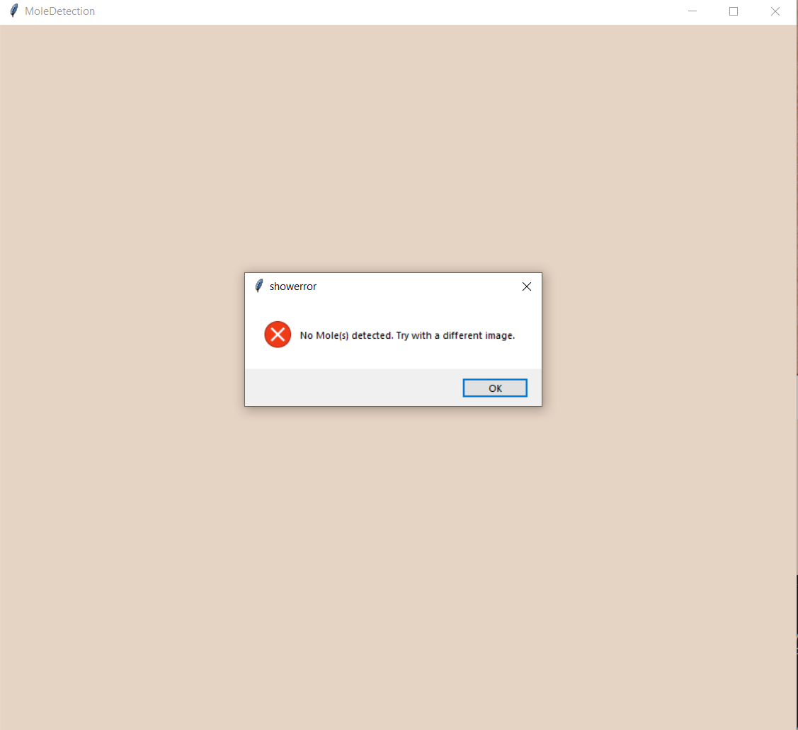

The "gui.py" is the GUI you run in python enviroment!

YOLOv8, uses 800 images for 32 epochs, 540 train, 160 test and 100 validation. 

Detections are where the downloaded predictions (Bbox, Mask and Seg).

PredictFunctions is my trained model using YOLOv8 functions to return predicted images.

Model3, has the YOLO model weights, images (train, val and test) in case someone else wants to add more training images.

requirements.txt is the python packages required to run the GUI!

FOR VISUAL STUDIO CODE press f5,

Pycharm run normally.

try (in the gui.py terminal)
pip install -r GUI/requirements.txt
or 
pip install-r requirements.txt

------ More Info ------

Detection(s), is the confidence level of the program in its prediction that it is a mole.
Mask, black and white distinction between mole and else.
Segmented Lesion, the reverse mask, adding back the medical image with colour.
Bounding box, the smallest box which is able to capture the features of the mole.

------ Detections folder ------

Bbox = coords of the bounding box
Mask = .jpg of the mask image
Seg = segmented lesion image

------ Model3 ------

Containes the data used to train the model, I had 3 models.
These all contained the same images, however I arranged them differently, i.e. shuffled the images in val, test and train.
These subsequently created new models with varying accuracies, I chose Model3 because it was the most accurate in detecting ALL moles within an image.
i.e. it was the best at finding the True real moles within an image, and not identifying false moles or incorrectly identifying moles [bad bounding boxes etc.].

------ labels ------

test = png of masks for the test batch images, you can use either .png or convert to text the coords of mole and not mole.
val = coords of val batch.
train = coords of train batch.

------ predicted folder ------

predicted = the predictions for all of the 160 test images. 159 images because it was unable to detect a mole in one of the images. Find it out if your up for a challenge ;)

------ runs ------

The folder created from training the model, .pt are the models created. I used model 3 again but trained it for 32 epochs instead. model 3 best.pt is trained for 12 epochs. 

Hope this is useful. Thank you for reading and checking out my 'Automation of mole detection and segmentation for medical images'.
With guidance from Mr Hongbo Du and Naseer Al-Jawad partnering with a Research team in siberia conducting research on feasible medical diagnosis using automation.
This was my part to project, coupled with the automation of diagnosis which was carried out by my peer Mr Ethan Nelson, for full fledged program.
